# 🤖 Forked-Golem

> **自律型 AI Agent — 運行在 ThinkPad X200 上的 Gemini 驅動本地代理人**

[](LICENSE)

Forked from [Arvincreator/project-golem](https://github.com/Arvincreator/project-golem) — 從 Puppeteer 瀏覽器自動化完全重構為 **API 直連架構**，專為低資源硬體設計。

---

## 與原版的關鍵差異

| | 原版 Project-Golem v8.6 | Forked-Golem |
|---|---|---|
| **LLM 連線** | Puppeteer → Web Gemini | Gemini API 直連 |
| **Telegram** | node-telegram-bot-api | grammy (auto-retry) |
| **RAM 佔用** | ~600MB (Chrome + Puppeteer) | ~80MB |
| **安全** | 無 | SecurityManager v2 (白名單/黑名單/Taint) |
| **技能系統** | 單一 skills.js | skills.d/ 模組化 + 動態載入 |
| **自主行為** | 無 | Autonomy v2 — Gemini 決策引擎 |
| **身份系統** | 無 | soul.md 靈魂文件 + journal 經驗迴路 |
| **時間排程** | IndexedDB (瀏覽器) | Chronos — setTimeout + JSON 持久化 |

---

## 系統架構

```mermaid
graph TD
    User((👤 使用者)) -->|"Telegram"| Grammy["grammy Bot Framework"]
    Grammy --> TQ["Titan Queue<br/>(防抖 + FIFO)"]

    TQ --> Brain["🧠 GolemBrain<br/>(Gemini API 直連)"]

    Brain --> TSP["TriStreamParser"]
    TSP --> Stream1["📝 記憶流"]
    TSP --> Stream2["🤖 行動流"]
    TSP --> Stream3["💬 回覆流"]

    Stream1 --> Memory[("💾 Memory Files")]
    Stream2 --> Shell["💻 Host System"]
    Stream2 --> Chronos["⏰ ChronosManager"]
    Stream3 --> User

    subgraph "🔐 SecurityManager v2"
        Whitelist["CMD 白名單"]
        Taint["Taint 偵測"]
    end

    Shell -.-> Whitelist
    Brain -.-> Taint

    subgraph "🌀 Autonomy v2"
        Soul["📜 soul.md"]
        Journal["📓 journal.jsonl"]
        Decision["Gemini 決策引擎"]
        Actions["GitHub 探索 · 自省 · 社交 · 休息"]
    end

    Decision -->|"讀取"| Soul
    Decision -->|"讀取"| Journal
    Decision -->|"選擇行動"| Actions
    Actions -->|"記錄結果"| Journal
    Actions -->|"通知"| User

    Chronos -->|"到期觸發"| Grammy

    subgraph "🔑 KeyChain"
        Keys["API Keys 輪替"]
        Cooldown["429 智慧退避"]
    end

    Brain -.-> Keys

    subgraph "📚 SkillLoader"
        AutoLoad["auto_load 高頻技能"]
        OnDemand["關鍵字路由低頻技能"]
    end

    Brain -.-> AutoLoad
```



---

## 核心功能

**GolemBrain** — Gemini API 直連的推理核心。透過 `@google/generative-ai` SDK 直接呼叫，支援 flash-lite（對話）和 flash（視覺分析）雙模型，KeyChain 管理 API Key 輪替與 429 智慧退避。

**Autonomy v2** — 自主行為系統。Golem 每隔約 200 分鐘自動醒來，讀取 `soul.md`（身份錨點）和 `journal.jsonl`（經驗記錄），由 Gemini 決定下一步行動：探索 GitHub 專案、自我反思、主動社交、或選擇休息。所有決策有依據，不是擲骰子。

**Chronos Timekeeper** — 時間排程系統。支援自然語言排程（「30 分鐘後提醒我」），使用 `setTimeout` 精確觸發 + JSON 持久化。重啟後自動恢復排程，過期排程立即補發。

**SecurityManager v2** — 安全管理。CMD 白名單控制可執行指令，外部內容 Taint 標記防止 prompt injection，黑名單阻擋已知危險操作。

**SkillLoader** — 模組化技能架構。`skills.d/` 目錄下的 `.md` 技能檔案按需載入，高頻技能自動注入 system prompt，低頻技能透過關鍵字路由動態載入，system prompt token 減少約 40%。

**Titan Queue** — 訊息防抖。1.5 秒 debounce 合併碎片訊息，FIFO 序列化處理，防止連發造成 API 浪費。

---

## 快速部署

```bash
git clone https://github.com/Golem-Beta/forked-golem.git
cd forked-golem
npm install
cp .env.sample .env   # 編輯填入你的 API key 和 Telegram token
```

**設定 `.env`：**
```
GEMINI_API_KEYS=your_key_1,your_key_2
TELEGRAM_TOKEN=your_telegram_bot_token
ADMIN_ID=your_telegram_user_id
GITHUB_REPO=YourOrg/your-forked-repo
```

**自訂身份（選填）：** 編輯 `soul.md` 賦予你的 Golem 獨特的身份、目標和價值觀。

**啟動：**
```bash
npm start              # Telegram bot 模式
npm start dashboard    # blessed 終端儀表板
```

---

## 目錄結構

```
forked-golem/
├── index.js              # 主程式（GolemBrain, SecurityManager, Autonomy, Chronos）
├── dashboard.js          # blessed 終端儀表板
├── soul.md               # 靈魂文件 — Golem 的身份錨點
├── skills.d/             # 模組化技能目錄
│   ├── CORE.md           # 核心指令集（auto_load）
│   ├── SHELL.md          # Shell 執行技能
│   ├── VISION.md         # 視覺分析技能
│   ├── EVOLUTION.md      # 自我進化技能
│   ├── CHRONOS.md        # 時間排程技能
│   └── ...
├── memory/
│   ├── journal.jsonl     # 經驗日誌（每次自主行動追加）
│   ├── explored-repos.json  # 已探索的 GitHub repo
│   └── schedules.json    # Chronos 排程持久化
├── .env.sample           # 環境變數範例
├── package.json
└── LICENSE
```

---

## 硬體需求

設計目標是在低資源設備上穩定運行：

- CPU: Intel Core2 Duo 等級即可
- RAM: 4GB 足夠（實際佔用 ~80MB）
- 作業系統: 任何支援 Node.js 的 Linux 發行版
- 網路: WiFi 或有線，需連接 Gemini API

開發環境使用 ThinkPad X200 (P8600, 4GB RAM, Arch Linux headless)。

---

## 版號管理

遵循 SemVer：`MAJOR.MINOR.PATCH`

- v9.0.0 = grammy 遷移基準
- MINOR = 新功能
- PATCH = bug fix

使用 `npm version [major|minor|patch]` 自動更新 package.json 並建立 git tag。

---

## 版本歷程

| 版本 | 內容 |
|------|------|
| v8.5-final | 回退基準 (pre-grammy) |
| v9.0.0 | grammy 遷移 — 移除 Puppeteer，API 直連 |
| v9.1.0 | SecurityManager v2 + Flood Guard |
| v9.1.1 | 429 智慧退避 + bug fixes |
| v9.2.0 | skills.d/ 模組化 + Titan Queue + ASCII Tri-Stream |
| v9.2.1 | 硬編碼版號修正 |
| v9.3.0 | Autonomy v2 Phase 1 — journal 經驗迴路 |
| v9.3.1 | Autonomy v2 Phase 2+3 — GitHub 探索 + Gemini 決策 + soul.md |
| v9.4.0 | Chronos 時間排程 + .env.sample |

---

## 致謝

- [Arvincreator/project-golem](https://github.com/Arvincreator/project-golem) — 原版 Project Golem，提供了核心概念和出發點
- Google Gemini API — 推理引擎
- [grammy](https://grammy.dev/) — Telegram Bot Framework

---

## License

MIT
